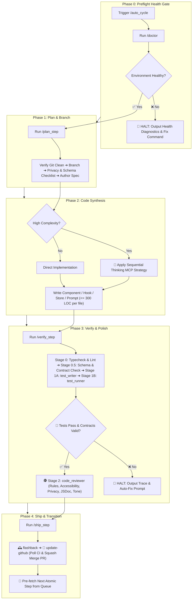

# ♾️ Auto Cycle — Master Autonomous Feature Lifecycle Orchestrator

`auto_cycle` is the overarching development orchestrator for the **Future You** project. It connects **[`doctor`](file:///d:/Future%20You/.agents/skills/doctor/SKILL.md)**, **[`plan_step`](file:///d:/Future%20You/.agents/skills/plan_step/SKILL.md)**, **Code Implementation**, **[`verify_step`](file:///d:/Future%20You/.agents/skills/verify_step/SKILL.md)**, and **[`ship_step`](file:///d:/Future%20You/.agents/skills/ship_step/SKILL.md)** into a continuous, guarded development loop.

---

## 🔄 The 5-Phase Lifecycle Architecture



---

## 🔒 The 6 Invariant Guardrails & Circuit Breakers

To guarantee stability, preserve user privacy, and eliminate runaway errors, `auto_cycle` enforces six non-negotiable gates:

| Gate | Trigger Condition | Automated Action |
| :--- | :--- | :--- |
| **0. Preflight Health Gate (doctor)** | Any failure in working tree, remote origin, CI workflow (`.github/workflows/ci.yml`), test setup (`fake-indexeddb`), or compiler (`tsc`). | **Halts immediately before branching or planning**. Outputs diagnostic remediation command. |
| **1. Clean Tree Gate** | Modified or untracked files detected before starting. | **Halts immediately**. Prompts developer to commit or stash. |
| **2. Context Window Gate** | Turn token consumption exceeds $\sim 75,000$ tokens. | Completes current atomic step, ships PR, and **pauses to start a fresh turn**, preserving 40–50% headroom. |
| **3. Test & Contract Failure Gate** | Any TypeScript error (`tsc --noEmit`), lint failure, or Jest/React assertion fails during verification. | **Hard stop**. Does NOT review or ship. Outputs failure analysis and single-turn fix prompt. |
| **4. Subagent Boundary Rule** | Subagents are used for parallel testing and code review. | **Subagents never touch Git directly**. All Git commits, pushes, and PR merges are strictly synchronous on the primary agent. |
| **5. Stage Timeout Circuit Breaker** | Any stage exceeds its time threshold: `doctor` (1 min), `plan_step` (5 min), Code Synthesis (10 min), `verify_step` (**10 min**), `ship_step` (**8 min** including CI polling). | **Interrupts hung process**, logs timeout diagnostic, and asks developer to resume or inspect. |

---

## 🌐 Project-Specific Quality & Stack Invariants

`auto_cycle` dynamically aligns with **Future You** architectural rules:

| Layer / Target | Compilation & Lint Command | Verification Suite |
| :--- | :--- | :--- |
| **Preflight Environment** | `npx tsc --noEmit && npm run lint` | `npm test -- --passWithNoTests` |
| **TypeScript & Next.js** | `npx tsc --noEmit && npm run lint` | `npm test -- <target>.test.tsx` |
| **Zustand & Local Storage** | `npx tsc --noEmit` | `npm test -- src/stores/<store>.test.ts` |
| **AI Client & Prompts** | `npx tsc --noEmit` | `npm test -- src/lib/ai/<module>.test.ts` |
| **UI Components (Tailwind)** | `npx tsc --noEmit` | `npm test -- src/components/<component>.test.tsx` |

---

## 📋 Execution Protocol

### Step 0: Preflight Health Inspection (`doctor`)

1. Executes [`doctor`](file:///d:/Future%20You/.agents/skills/doctor/SKILL.md).
2. Verifies working tree cleanliness, remote origin connectivity, CI workflow presence in `.github/workflows/ci.yml`, `fake-indexeddb` test setup, and zero TypeScript compiler errors.
3. If any check fails, **HALTS IMMEDIATELY** and outputs the diagnostic remediation instructions.

---

### Step 1: Planning & Branch Provisioning (`plan_step`)

1. Executes [`plan_step`](file:///d:/Future%20You/.agents/skills/plan_step/SKILL.md).
2. Identifies the next incomplete Goldilocks step from [`implementation_plan.md`](file:///d:/Future%20You/implementation_plan.md).
3. Verifies `git status -s`, switches to `main`, pulls latest, and branches off: `feat/<feature-slug>`.
4. Evaluates Privacy, Disclaimer, and Storage impacts and authors the technical specification file in `docs/specs/<feature-slug>.md`.

---

### Step 2: Implementation & Code Synthesis

1. Implements data models, Zustand stores, React components, or AI prompts matching the specification.
2. If Sequential Thinking MCP was recommended in the spec (e.g. persona prompt consistency, habit lever deltas, JSON schema parsing), executes multi-stage hypothesis validation before writing complex logic.
3. Adheres strictly to the LOC limit ($\le 300$ LOC per file) to avoid monolithic files.
4. Uses `function` declarations for components, destructured typed props, and mandatory JSDoc comments.

---

### Step 3: Dual Verification & Polish (`verify_step`)

1. Executes [`verify_step`](file:///d:/Future%20You/.agents/skills/verify_step/SKILL.md).
2. Stage 0 runs strict TypeScript compilation (`tsc --noEmit`) and Next.js/ESLint checks.
3. Stage 0.5 verifies data contract adherence (Zustand state types, OpenAI-compatible JSON schemas, `future-you:` localStorage prefix).
4. Stage 1A spawns `test_writer` to author spec-driven unit/integration tests using the **Codebase Mock Catalog** (mocking localStorage, IndexedDB, Web Speech API, and OpenAI client).
5. Stage 1B spawns `test_runner` to execute the targeted test command (`npm test -- <file>.test.ts`).
6. If tests pass, runs `code_reviewer` (Stage 2) for static architectural, privacy, honesty disclaimer, aria-label, and styling compliance.
7. If issues arise, prompts developer and applies fixes before proceeding.

---

### Step 4: Release, Sync & Loop (`ship_step`)

1. Executes [`ship_step`](file:///d:/Future%20You/.agents/skills/ship_step/SKILL.md).
2. Logs milestone in [`.agents/memory/flashback.md`](file:///d:/Future%20You/.agents/memory/flashback.md) and marks task `[x]` in [`implementation_plan.md`](file:///d:/Future%20You/implementation_plan.md).
3. Creates a conventional commit ($<100$ chars), pushes to GitHub, creates PR, polls CI status checks until green, and executes **Squash Merge** into `main`.
4. Cleans up local branch, retains remote branch on GitHub, and queues up the next atomic step.

---

## 📤 Standard Cycle Summary Output

```markdown
# ♾️ /auto_cycle Complete — [Step ID: Feature Title]

### 📊 Lifecycle Execution Summary

- **0. Preflight Health**: `✓` Environment, CI workflow & dependencies verified by `doctor`.
- **1. Planning & Spec**: `✓` Created branch `feat/[slug]` and spec `docs/specs/[slug].md`.
- **2. Implementation**: `✓` Generated [N] files ([X] LOC total, max <= 300 LOC/file).
- **3. Dynamic Verification**: `✓` [K] tests passed (0 failures, contracts verified).
- **4. Static Review**: `✓` Architecture verified against Future You rules (.rules / GEMINI.md).
- **5. Shipping & Memory**: `✓` PR #<N> CI passed & squash-merged to `main`, `flashback.md` updated.

---

### 🌿 Git & Repository State

- **Current Branch**: `main` (Up to date)
- **Remote Branch**: `origin/feat/[slug]` (Preserved on GitHub)

---

### 🎯 Next Atomic Step in Queue

> **[Next Step ID] — [Next Step Title]**  
> _Objective: [1-sentence description]_

---

### ⚡ Continue Auto Cycle?

Would you like me to start the next `/auto_cycle` for **[Next Step ID: Next Step Title]**?
```

---

## 🚀 Triggers

- `/auto_cycle`
- `/auto_cycle [step-number] [feature-name]`
- `"Run full autonomous cycle for next feature"`
- `"Execute next step end-to-end"`
