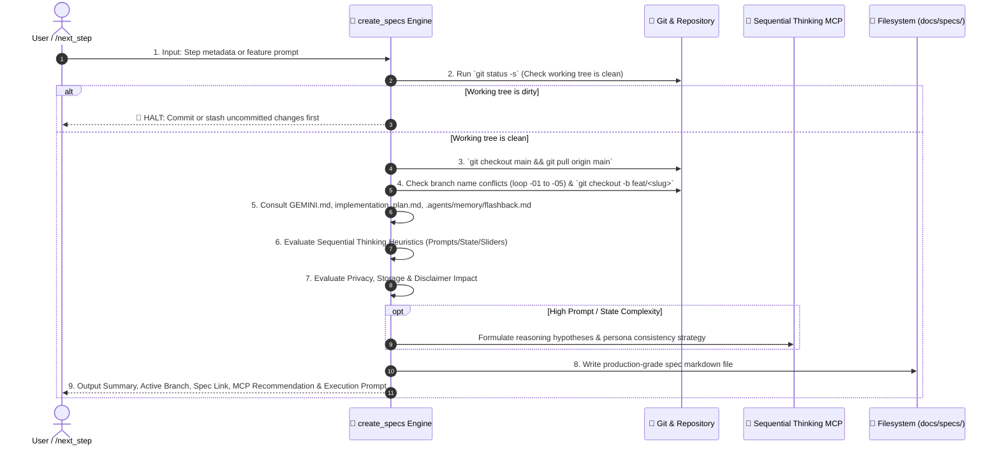

# 📝 Create Specs — Technical Specification & Git Branch Provisioner

`create_specs` is the technical authoring and branch preparation engine for **Future You**. It takes a proposed atomic step (from `/next_step` or user input), verifies workspace cleanliness, creates a dedicated Git feature branch off the latest `main`, evaluates prompt engineering and state complexity for Sequential Thinking MCP acceleration, embeds local-first Privacy & Honesty Disclaimer safety rules, and generates a rigorous, production-grade technical specification markdown file saved to `docs/specs/<feature-slug>.md`.

---

## 🔒 Step-by-Step Provisioning Workflow



---

## 🛠️ Execution Pipeline

### Step 1 — Check Working Directory Cleanliness

Run:

```bash
git status -s
```

- **Hard Gate**: Check for uncommitted, unstaged, or untracked changes.
- If any modified or untracked files exist, **STOP IMMEDIATELY** and notify the developer:
  > _"Working directory has uncommitted changes. Please commit or stash changes before creating a new spec and branch."_
- **DO NOT CONTINUE** until the working directory is clean.

---

### Step 2 — Parse Arguments & Metadata

Extract metadata from `/next_step` handoff or user prompt:

1. `step_number`: e.g. `1.1`, `4.2`, `7.1`
2. `feature_title`: Human-readable title in Title Case (e.g. `Onboarding Habits Step & Sliders`)
3. `feature_slug`: Git- and filename-safe slug in lowercase kebab-case (e.g. `step-4-2-habits-step`)
4. `branch_name`: Format `feat/<feature_slug>` (max 40 chars)

---

### Step 3 — Check Branch Name Availability & Conflict Resolution

Run:

```bash
git branch --list "<branch_name>*"
```

- **Conflict Resolution Loop**:
  - If `<branch_name>` does not exist: use `<branch_name>`.
  - If `<branch_name>` exists: iterate suffixes `-01`, `-02`, `-03`, `-04`, `-05` until an unused branch name is found.
  - Set `RESOLVED_BRANCH` to the unique candidate name.

---

### Step 4 — Switch to Main and Pull Latest

Run:

```bash
git checkout main
git pull origin main
```

#### 🚨 Git Error Recovery Protocol:
1. **Pull Merge Conflict**: If `git pull` encounters conflicts with local stashes, run `git stash`, pull upstream, and resolve.
2. **Untracked Overwrite**: Move or clean untracked build files before checkout.
3. **Upstream Divergence**: If local `main` diverged, verify with `git log --oneline -n 5` before rebasing.

---

### Step 5 — Create and Switch to Feature Branch

Run:

```bash
git checkout -b <RESOLVED_BRANCH>
```

---

### Step 6 — Deep Research & Cross-Referencing

Mandatorily read and verify against:

- 📖 [`GEMINI.md`](file:///d:/Future%20You/GEMINI.md) / [`.rules`](file:///d:/Future%20You/.rules) — Coding rules, privacy constraints, tech stack locks.
- 🗺️ [`implementation_plan.md`](file:///d:/Future%20You/implementation_plan.md) — Phased task checklists and dependencies.
- 🕰️ [`.agents/memory/flashback.md`](file:///d:/Future%20You/.agents/memory/flashback.md) — Canonical living memory ledger, active phase, ADRs.
- 📐 [`design.md`](file:///d:/Future%20You/design.md) & [`architecture.md`](file:///d:/Future%20You/architecture.md) — Component specs, color tokens, TypeScript schemas.

---

### Step 7 — Sequential Thinking MCP Decision Heuristics

Evaluate complexity against the following criteria to determine whether to recommend `sequential-thinking` MCP:

#### Complexity Triggers:
1. **Persona Prompt Consistency & Voice Grounding**:
   - Multi-year timeline projection logic (Years 1, 3, 5).
   - Tone calibration between Current Path (realistic, slight regret) and Improved Path (fulfilling, disciplined).
   - System prompt architecture to guarantee no hallucination or broken persona.
2. **Habit Levers Dynamic Recalculation**:
   - Calculating deltas when sliders (sleep, study, savings) change.
   - Determining which lever has the highest impact on timeline outcomes.
3. **Streaming & State Coordination**:
   - Token-by-token streaming from OpenAI-compatible endpoints into Zustand/IndexedDB.
   - Managing multi-step onboarding state transitions with persistent drafts.

#### Action on Match:
- When a task matches ANY complexity trigger:
  1. Include `## 4. 🧠 Sequential Thinking Strategy` in the spec.
  2. Add recommendation prompt in output summary.
  3. During implementation, invoke `call_mcp_tool` with `ServerName: "sequential-thinking"` and `ToolName: "sequentialthinking"`.

---

### Step 8 — Privacy, Storage & Accessibility Impact Checklist

Evaluate whether the feature impacts privacy, storage, or accessibility:

1. **Privacy & Local Storage**:
   - Uses `future-you:` prefix for any new localStorage key.
   - Ensures no API keys or personal reflections leak into telemetry or network requests.
2. **Honesty Disclaimer**:
   - Verifies system prompt or UI component embeds the mandatory reflection disclaimer.
3. **Accessibility**:
   - `aria-label` specified on all interactive controls.
   - Dark mode contrast ratio $\ge 4.5:1$.

---

### Step 9 — Destination Path Determination

Save the specification file to:

```
docs/specs/<feature-slug>.md
```

---

### Step 10 — Author the Specification File

The generated markdown spec file MUST follow this exact structure:

````markdown
# 📄 Technical Specification: [Feature Title]

> **Step ID**: `[Step ID]`  
> **Target Module**: `[src/components/... | src/stores/... | src/lib/ai/...]`  
> **Git Feature Branch**: `[branch_name]`  
> **Status**: 📋 Draft / Ready for Implementation  
> **Created**: YYYY-MM-DD

---

## 1. Executive Summary

[2-3 sentence overview of what is being built, the user experience it provides, and how it fits into the Future You vision.]

---

## 2. Dependencies & Prerequisites

- **Depends on**: [List of previous steps, components, or stores required]
- **Blocked by**: [None or specific prerequisite]
- **New Packages / Libraries**: [None — tech stack is locked]

---

## 3. 🔒 Privacy, Storage & Disclaimer Impact

- [ ] **LocalStorage Prefix**: Keys use `future-you:[key]` format.
- [ ] **Zero Cloud Storage**: All state is local.
- [ ] **Honesty Disclaimer**: Mandatory reflection disclaimer present.
- [ ] **Accessibility**: `aria-label` on all interactive elements.

---

## 4. 🧠 Sequential Thinking Strategy _(Included if high complexity)_

- **Prompt Engineering Hypotheses**: [Validation of tone, grounding, and format]
- **Edge Cases & Error Fallbacks**: [Timeout, invalid API key, malformed JSON recovery]

---

## 5. Component / Store / Data Contracts

### 5.1 Props & State Interfaces

```typescript
// Concrete TypeScript interfaces (prefer interface over type)
export interface FeatureProps {
  // ...
}
```

---

## 6. Step-by-Step Implementation Sequence

1. **Phase A: Types & Store Updates**
   - [ ] Define types in `src/types/<module>.types.ts`
   - [ ] Update Zustand store in `src/stores/<store>.ts`
2. **Phase B: Component / Utility Implementation**
   - [ ] Build component using `function` declaration (<= 300 LOC)
   - [ ] Add Tailwind styling & Framer Motion transitions (<= 300ms)
3. **Phase C: Tests & Verification**
   - [ ] Write unit test with mocked storage/AI client

---

## 7. Verification & Acceptance Criteria

### Automated Tests
```bash
npm test -- src/path/to/<feature>.test.tsx
```

### Acceptance Checklist
- [ ] Component renders cleanly in dark theme
- [ ] All interactive elements reachable via Tab key
- [ ] Max file length <= 300 lines
- [ ] `tsc --noEmit` returns 0 errors
````

---

## 📤 Standard Output Format

```markdown
### 📌 Feature Summary: [Feature Title]
- **Scope**: [1-2 bullet points summarizing the technical scope]
- **Key Files**: List of `[NEW]` and `[MODIFY]` target files.

---

### 🧠 Sequential Thinking MCP Recommendation
*(Include if task meets high complexity heuristics)*
> 🧠 **Recommendation**: Use Sequential Thinking MCP for multi-stage reasoning on **[Complex Area]** (`Approve` / `Skip`).

---

### 🌿 Git Feature Branch
`[branch_name]` *(Created and checked out from latest main)*

---

### 📁 Technical Spec Created
- [docs/specs/feature-slug.md](file:///d:/Future%20You/docs/specs/feature-slug.md)

---

### ⚡ Ready to Implement?
Would you like me to begin executing the implementation tasks in this specification?
```

---

## 🚀 Triggers

- `/create_specs [step-number] [feature-name]`
- `/create-spec [feature-name]`
- `"Create spec for onboarding habit step"`
- Automatic invocation from `/next_step`
