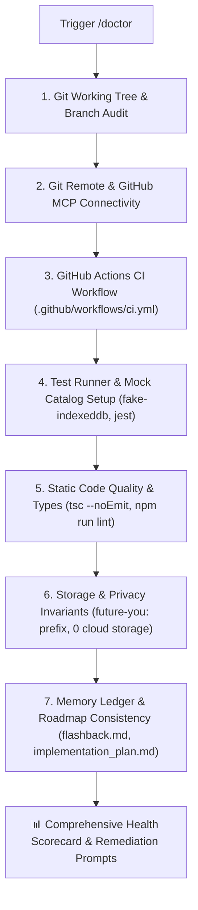

# 🩺 Doctor — Environment & Preflight Health Inspector

`doctor` is the automated preflight verification and diagnostic engine for **Future You**. It audits workspace health, git remote connectivity, GitHub Actions CI workflows, test runner prerequisites, and architectural invariants before launching `/auto_cycle` or embarking on a new implementation phase.

---

## 🔍 Preflight Diagnostic Checklist



---

## 🛠️ Audit Vectors & Verification Commands

### 1. Git Working Tree & Branch Integrity
- **Command**: `git status -s && git branch --show-current`
- **Expected**:
  - Clean working directory (0 modified/untracked files).
  - On branch `main` before starting planning or cycle runs.
- **Remediation**:
  ```bash
  git stash # or commit active changes
  git checkout main
  git pull origin main
  ```

### 2. Git Remote & GitHub MCP Connectivity
- **Command**: `git remote -v`
- **Expected**: `origin` remote configured pointing to the user's GitHub repository.
- **Remediation**:
  ```bash
  git remote add origin https://github.com/<user>/<repo>.git
  ```

### 3. GitHub Actions CI Configuration
- **Target File**: [`.github/workflows/ci.yml`](file:///d:/Future%20You/.github/workflows/ci.yml)
- **Expected**: Workflow present, triggering on `pull_request` and `push` to `main`, executing `npm test` and `tsc --noEmit`.
- **Why It Matters**: Prevents `ship_step` and `update-github` from hanging or timing out while polling CI status checks.

### 4. Test Environment & Storage Mocks
- **Audit**:
  - `fake-indexeddb` installed in `package.json` devDependencies.
  - `jest.setup.ts` imports `'fake-indexeddb/auto'`.
  - `@testing-library/react` and `jest-environment-jsdom` present.
- **Command**: `npm test -- --passWithNoTests`
- **Why It Matters**: Prevents `ReferenceError: indexedDB is not defined` during Phase 2 & Phase 9 chat/state testing.

### 5. Static Compilation & Lint Gate
- **Command**: `npx tsc --noEmit && npm run lint`
- **Expected**: 0 TypeScript compilation errors, 0 ESLint errors.

### 6. Storage & Privacy Invariants
- **Target Files**: `src/stores/`, `src/lib/`
- **Audit**:
  - All Zustand `persist` keys and manual storage calls use the prefix `future-you:`.
  - ZERO external database connection strings or analytics trackers.
  - All AI prompt templates in `src/lib/prompts/` contain the honesty disclaimer:
    > *"You are a reflection tool, not a prediction engine"*

### 7. Living Memory & Master Roadmap Consistency
- **Target Files**:
  - Master Roadmap: [`implementation_plan.md`](file:///d:/Future%20You/implementation_plan.md)
  - Memory Ledger: [`.agents/memory/flashback.md`](file:///d:/Future%20You/.agents/memory/flashback.md)
- **Audit**:
  - `flashback.md` contains all 4 canonical sections (Executive Status Snapshot, ADRs, Phase Tracker, Activity Log).
  - The next incomplete step in `implementation_plan.md` matches the active phase in `flashback.md`.

---

## 📤 Standard Diagnostic Report Output

```markdown
# 🩺 Future You — Doctor Health Inspection Report

### 📊 Health Scorecard

| Check Vector | Status | Findings / Details |
| :--- | :--- | :--- |
| **Git Working Tree** | 🟢 PASS | Clean tree on `main` |
| **Remote Connectivity** | 🟢 PASS | Remote `origin` detected |
| **GitHub Actions CI** | 🟢 PASS | `.github/workflows/ci.yml` present |
| **Test Environment** | 🟢 PASS | `fake-indexeddb` & Jest configured |
| **TypeScript / Lint** | 🟢 PASS | 0 type errors, 0 lint warnings |
| **Privacy Invariants**| 🟢 PASS | `future-you:` prefix & disclaimer verified |
| **Roadmap & Memory** | 🟢 PASS | `flashback.md` synced with `implementation_plan.md` |

---

### 🚦 Verdict: 100% HEALTHY — Ready for /auto_cycle

All preflight diagnostics passed. The repository is configured for reliable, hands-off autonomous execution.
```

---

## 🚀 Triggers

- `/doctor`
- `/preflight`
- `"Run doctor check"`
- `"Check environment and project health"`
