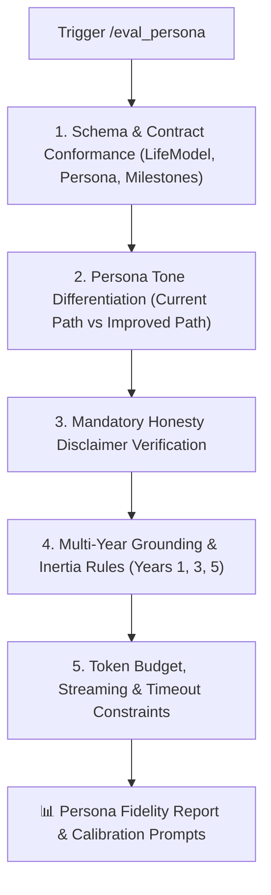

# 🎭 Eval Persona — AI Prompt & Persona Fidelity Evaluator

`eval_persona` is the prompt engineering auditor and persona fidelity evaluator for **Future You**. It guarantees that system prompts and generation orchestrators in `src/lib/prompts/` and `src/lib/ai/` produce schema-compliant, emotionally differentiated, grounded projections without hallucination or fatalism.

---

## 🎯 The 5 Core Evaluation Vectors



---

## 📋 Evaluation Guidelines & Invariants

### 1. Schema & Contract Conformance
- Every prompt designed to return structured JSON must conform to the project types:
  - `types/life-model.types.ts`: `LifeModel`, `HabitLever`
  - `types/persona.types.ts`: `Persona`, `PersonaCareer`, `PersonaHealth`, `PersonaFinances`, `PersonaRelationships`
  - `types/timeline.types.ts`: `TimelineMilestone`
- Fallback strategies must be in place to strip markdown backticks (`\`\`\`json`) and parse partial JSON strings cleanly.

### 2. Tone & Emotional Differentiation
- **Current Path Persona**:
  - Voice: Realistic, reflective, slightly fatigued, inertia-driven.
  - Tone: Honest about missed opportunities or lingering bad habits, but NOT nihilistic, despairing, or suicidal.
  - Perspective: Reflects the compounding cost of inaction over 5 years.
- **Improved Path Persona**:
  - Voice: Disciplined, purposeful, grounded, energized.
  - Tone: Encouraging, thoughtful, and pragmatic — NEVER toxic positivity, miracle transformations, or overnight billionaire fantasies.
  - Perspective: Reflects the compounding benefit of deliberate habits.

### 3. Mandatory Honesty Disclaimer
- **Rule**: Every prompt template MUST contain the exact honesty disclaimer in its system prompt:
  > *"You are a reflection tool, not a prediction engine"*
- Outputs must avoid fatalistic certainty phrases like:
  - ❌ *"You will definitely end up broke."*
  - ❌ *"Your fate is sealed."*
  - ✅ *"If daily patterns persist, financial strain tends to compound like this..."*

### 4. Grounding Across 1, 3, and 5-Year Projections
- **Year 1**: Subtle, early signs of trajectory changes.
- **Year 3**: Tangible consolidation of habits, forks in career/health.
- **Year 5**: Deep divergence between paths. Character voice must remain consistent with the onboarding input (values, fears, goals).

### 5. Token & Latency Budget
- Maximum prompt input tokens: $\le 2,500$ tokens.
- Maximum completion output tokens: $\le 1,500$ tokens.
- Streaming responses must deliver the first token within $2.5$ seconds.
- Hard timeout constraint: $60$ seconds with `AbortController`.

---

## 🛠️ Audit Protocol & Workflow

1. **Ingest Target Prompt**: Read template from `src/lib/prompts/<prompt-file>.ts`.
2. **Static Invariant Scan**:
   - Check for honesty disclaimer string inclusion.
   - Verify prompt is exported as a typed template literal function.
   - Verify no hardcoded API keys.
3. **Mock Generation & Schema Test**:
   - Feed standardized mock onboarding fixtures through the prompt.
   - Parse LLM output against the target TypeScript schema.
4. **Tone Audit**: Compare Current vs Improved outputs for distinct voice and absence of extreme hallucinations.
5. **Output Fidelity Scorecard**: Output report with pass/fail grades and fine-tuning recommendations.

---

## 📤 Standard Fidelity Report Output

```markdown
# 🎭 Persona Fidelity Report — [Prompt / Template Name]

### 📊 Evaluation Scorecard

| Evaluation Vector | Status | Notes |
| :--- | :--- | :--- |
| **Schema Conformance** | 🟢 PASS | Output matches `Persona` TypeScript interface |
| **Tone Differentiation** | 🟢 PASS | Clear contrast between inertia and disciplined growth |
| **Honesty Disclaimer** | 🟢 PASS | "Reflection tool, not prediction" verified |
| **Projection Grounding** | 🟢 PASS | Realistic 1/3/5 year compounding curves |
| **Token Budget & Latency**| 🟢 PASS | Est. 850 tokens completion, within 60s timeout |

---

### 💡 Tone & Calibration Insights

- **Current Path Feedback**: Well-balanced realism; accurately highlights friction in career goals.
- **Improved Path Feedback**: Practical advice grounded in daily habits without grandiose claims.

---

### 🚦 Verdict: READY FOR PRODUCTION
```

---

## 🚀 Triggers

- `/eval_persona`
- `/eval_prompt`
- `"Evaluate persona prompts"`
- `"Audit prompt consistency and tone"`
