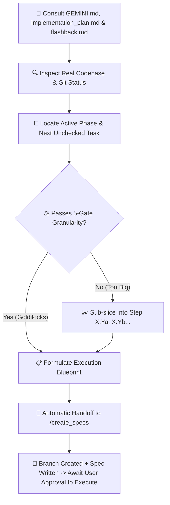

# 🎯 Next Step — Atomic Action Planner & Specification Handoff

`next_step` is the tactical pacing and alignment mechanism for **Future You**. It bridges the master roadmap in [`implementation_plan.md`](file:///d:/Future%20You/implementation_plan.md) with the live project state in [`.agents/memory/flashback.md`](file:///d:/Future%20You/.agents/memory/flashback.md) and the architectural invariants in [`GEMINI.md`](file:///d:/Future%20You/GEMINI.md) / [`.rules`](file:///d:/Future%20You/.rules).

It strictly enforces the **5-Gate Goldilocks Task Granularity Standard**, guaranteeing that every step fits within the model's context window with **40–50% reserved headroom** for iterative edits, debugging, test runs, and code reviews before handing over to [`create_specs`](file:///d:/Future%20You/.agents/skills/create_specs/SKILL.md).

---

## 🏛️ Mandatory Three-Pillar Context Consultation

Before formulating ANY next step, action plan, or verdict, `next_step` **MUST MANDATORILY READ AND CROSS-REFERENCE ALL THREE CORE FILES**:

1. 📖 [`GEMINI.md`](file:///d:/Future%20You/GEMINI.md) / [`.rules`](file:///d:/Future%20You/.rules) — Master rules, client-only privacy invariants, function component declarations, 300 LOC limits, and prompt storage rules.
2. 🗺️ [`implementation_plan.md`](file:///d:/Future%20You/implementation_plan.md) — Phased master checklists (Phases 0–14), build order, dependencies, and exit criteria.
3. 🕰️ [`.agents/memory/flashback.md`](file:///d:/Future%20You/.agents/memory/flashback.md) — Canonical living memory ledger, ADRs, active phase status, and chronological changelog.

_Additionally, perform a quick scan of the workspace files to ensure the proposed task aligns with real repository state._

---

## ⚖️ The 5-Gate Goldilocks Granularity Standard

To prevent context exhaustion and ensure maximum code quality, every step MUST pass all 5 gates before handoff:

```
┌────────────────────────────────────────────────────────────────────────┐
│ Context Window Breakdown (128k Token Standard Budget)                  │
├────────────────────────────────────────────────────────────────────────┤
│ Base Overhead (Prompts, Tools, References, System Invariants)  : ~50k  │
│ Target Step Code Generation (~150-300 LOC)                    : ~4k    │
│ Test Runner Execution & Stack Traces                           : ~4k    │
│ Iterative Debugging & Type-Fix Loops (1-2 turns)               : ~15k   │
│ Code Reviewer Evaluation & Diff Analysis                       : ~5k    │
├────────────────────────────────────────────────────────────────────────┤
│ PEAK TURN USAGE (Goldilocks Sized Step)                        : ~78k  │
│ RESERVED SAFETY HEADROOM (35–45% Buffer for Iterations)        : ~50k  │
└────────────────────────────────────────────────────────────────────────┘
```

### The 5 Gates Checklist:

1. **Target File Gate**: $\le 4$ target files total ($\le 2$ components/hooks, $\le 1$ store/type file, $\le 1$ test file).
2. **Code Volume Gate**: $\le 300$ LOC per file (strict project limit from `.rules`), calibrated for React components, Tailwind styling, interfaces, and JSDoc.
3. **Single Architectural Concern**: Step addresses exactly ONE layer (e.g. Types + Store OR UI Component + Hook OR Prompt Template + AI Client; never full-stack from scratch in one turn).
4. **Verifiable Unit Gate**: Exactly 1 targeted test command to prove correctness (`npm test -- src/...`).
5. **Headroom Assurance Gate**: Estimated turn consumption $\le 25,000$ tokens, ensuring $\ge 40\%$ context window headroom remains for debugging and reviewer feedback.

---

## ✂️ Automatic Sub-Slicing Rule

If a roadmap task in [`implementation_plan.md`](file:///d:/Future%20You/implementation_plan.md) fails ANY of the 5 gates (e.g. an entire multi-step onboarding wizard or the full dashboard split view):

- **Do NOT attempt to execute the entire task at once.**
- Automatically slice it into alphabetical sub-steps: `Step X.Ya`, `Step X.Yb`, `Step X.Yc`.
- Package only the **first incomplete sub-step** and pass it to `create_specs`.
- Note the remaining sub-steps in the "Up Next in Queue" section.

---

## 🔄 Workflow & Operating Procedure



### Step 1: Consult Three Core Files & Codebase
- Read `GEMINI.md` / `.rules` for coding invariants.
- Read `implementation_plan.md` to dynamically locate the current unchecked task `[ ]`.
- Read `.agents/memory/flashback.md` for latest ADRs and activity history.
- Inspect workspace directories to check existing components and stores.

### Step 2: Apply 5-Gate Sizing & Formulate Blueprint
Extract:
- `step_number`: e.g. `1.1`, `3.2`, `4.1a`
- `feature_title`: Human-readable title in Title Case (e.g. `Primary Button & Card Primitives`)
- `feature_slug`: Kebab-cased slug (e.g. `step-1-1-button-card-primitives`)
- `target_files`: List of files within calibrated file limits ($\le 4$ files, $\le 300$ LOC/file)
- `objective`: 1-2 sentence statement of purpose
- `execution_checklist`: Specific atomic tasks
- `verification_criteria`: 1 targeted acceptance command and test

### Step 3: Automatic Handoff to `create_specs`
Immediately invoke or trigger `create_specs` with the formulated step metadata so that:
1. Working directory cleanliness is verified (`git status -s`).
2. Latest `main` is checked out and updated (`git checkout main && git pull origin main`).
3. Dedicated feature branch is created (`git checkout -b feat/<feature_slug>`).
4. Production-grade technical specification file is written to `docs/specs/<feature_slug>.md`.

---

## 📤 Standard Output Format

```markdown
### 🧭 Current Status Snapshot

- **Active Phase**: Phase X — [Phase Name]
- **Consulted References**: `GEMINI.md` | `implementation_plan.md` | `flashback.md`
- **Last Completed**: [Brief mention of the most recently finished task/milestone]

---

### 🎯 Immediate Next Step: [Step ID] — [Step Title]

- **Scope**: Single Atomic Task (Goldilocks Calibrated: ~[X] LOC, [N] files)
- **Target Files**:
  - `[NEW]` [src/path/to/file.tsx](file:///d:/Future%20You/src/path/to/file.tsx)
  - `[MODIFY]` [src/path/to/file.ts](file:///d:/Future%20You/src/path/to/file.ts)
- **Objective**: [1-2 sentences clearly describing what this specific step achieves]

#### 📋 Execution Checklist for this Step

1. [ ] [Specific sub-task 1, e.g. Define interface props and export function declaration]
2. [ ] [Specific sub-task 2, e.g. Add aria-labels and Framer Motion animation]
3. [ ] [Specific sub-task 3, e.g. Add JSDoc comments and export]

#### 🧪 Verification & Acceptance Criteria

- [ ] [Single targeted test command, e.g. `npm test -- src/components/ui/button.test.tsx`]
- [ ] [Expected outcome or visual shape]

---

### 🚀 Handoff to `create_specs`

_Proceeding to invoke `/create_specs` with:_

- **Step ID**: `[Step ID]`
- **Title**: `[Step Title]`
- **Slug**: `[feature-slug]`
- **Branch**: `feat/[feature-slug]`
- **Spec Path**: `docs/specs/[feature-slug].md`

_(Calling `create_specs` to verify git status, branch off main, and generate the technical spec...)_
```

---

## 🚀 Triggers

- `/next_step`
- `"What is the next step?"`
- `"Suggest next action"`
- `"What should we work on next?"`
