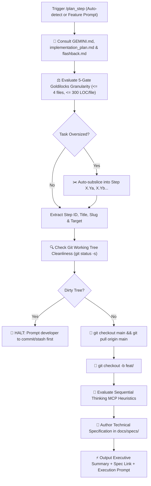

# 🚀 Plan Step — Automated Planning & Branch Provisioning Pipeline

`plan_step` is the automated front-end of the **Future You** development lifecycle. It eliminates manual planning and Git branch overhead by unifying **[`next_step`](file:///d:/Future%20You/.agents/skills/next_step/SKILL.md)** and **[`create_specs`](file:///d:/Future%20You/.agents/skills/create_specs/SKILL.md)** into a single, cohesive command.

---

## 🔄 End-to-End Pipeline Workflow



---

## 🛑 MANDATORY STOP GATE: Anti-Auto-Advance Rule

> **CRITICAL RULE**: After `/plan_step` completes branch creation and specification authoring, the agent **MUST IMMEDIATELY STOP** and await explicit developer approval.
> **DO NOT** write application code.
> **DO NOT** run `/verify_step`.
> **DO NOT** run `/ship_step`.
> The only exception is if the developer explicitly launched `/auto_cycle`.

---

## 🔒 Automated Execution Stages

### Stage 1: Reference Ingestion & Task Sizing (`next_step`)

1. Mandatorily reads all three core project references:
   - 📖 [`GEMINI.md`](file:///d:/Future%20You/GEMINI.md) / [`.rules`](file:///d:/Future%20You/.rules) — Coding rules, privacy constraints, prompt externalization, 300 LOC limit.
   - 🗺️ [`implementation_plan.md`](file:///d:/Future%20You/implementation_plan.md) — Phased master task checklists and milestones.
   - 🕰️ [`.agents/memory/flashback.md`](file:///d:/Future%20You/.agents/memory/flashback.md) — Canonical active phase, ADRs, and recent changelog.
2. Identifies the first incomplete task `[ ]` or processes the developer's manual feature argument.
3. Evaluates the task against the **5-Gate Goldilocks Standard**:
   - Target files: $\le 4$ files total.
   - Code volume: $\le 300$ LOC per file (strict limit).
   - Single architectural concern.
   - 1 targeted verification command.
   - $\ge 40\%$ context window headroom.
4. If oversized, automatically sub-slices into `Step X.Ya`, `Step X.Yb`, etc.

---

### Stage 2: Git Cleanliness & Branch Creation (`create_specs`)

1. Runs `git status -s`. If any uncommitted changes exist:
   - **HARD STOP**: Alerts developer to stash or commit changes. Halts execution.
2. Checks out latest `main` and pulls upstream:
   ```bash
   git checkout main
   git pull origin main
   ```
3. Checks existing branches (`git branch`) and creates the dedicated feature branch:
   ```bash
   git checkout -b feat/<feature-slug>
   ```

---

### Stage 3: Sequential Thinking MCP Evaluation & Spec Generation

1. Evaluates prompt engineering, persona grounding, habit lever calculation, or streaming complexity:
   - Dynamic prompt generation with persona tone alignment (Current vs Improved).
   - Habit lever delta math recalculating milestones upon slider changes.
   - Streaming LLM tokens into Zustand and IndexedDB.
   - Local-first privacy and honesty disclaimer integrity.
2. Determines destination path: `docs/specs/<feature-slug>.md`.
3. Writes production-grade technical specification markdown file with data contracts, UI components, implementation sequence, edge cases, and test criteria.

---

## 📤 Standard Output Format

```markdown
# 📋 /plan_step Complete — [Step ID: Feature Title]

### 🧭 Project Context

- **Active Phase**: Phase X — [Phase Name]
- **Target Files**: `[src/components/... | src/stores/... | src/lib/ai/...]`
- **Granularity Sizing**: Goldilocks Verified (~[X] LOC, [N] files, ~45% context headroom reserved)

---

### 🌿 Git Feature Branch

`feat/[feature-slug]` _(Checked out and synchronized from origin/main)_

---

### 📁 Technical Specification Created

- [docs/specs/spec.md](file:///d:/Future%20You/docs/specs/spec.md)

---

### 🧠 Sequential Thinking MCP Recommendation

_(Appears only if task meets high complexity heuristics)_

> 🧠 **Recommendation**: Use Sequential Thinking MCP for multi-stage reasoning on **[Complex Area]** (`Approved` / `Skipped`).

---

### ⚡ Ready to Implement?

The specification is locked and the branch is clean. Would you like me to begin implementing this feature now?
```

---

## 🚀 Triggers

- `/plan_step` (Auto-locates next unchecked step from `implementation_plan.md`)
- `/plan_step [step-number] [feature-name]`
- `"Plan next step and create branch"`
- `"Start next feature"`
