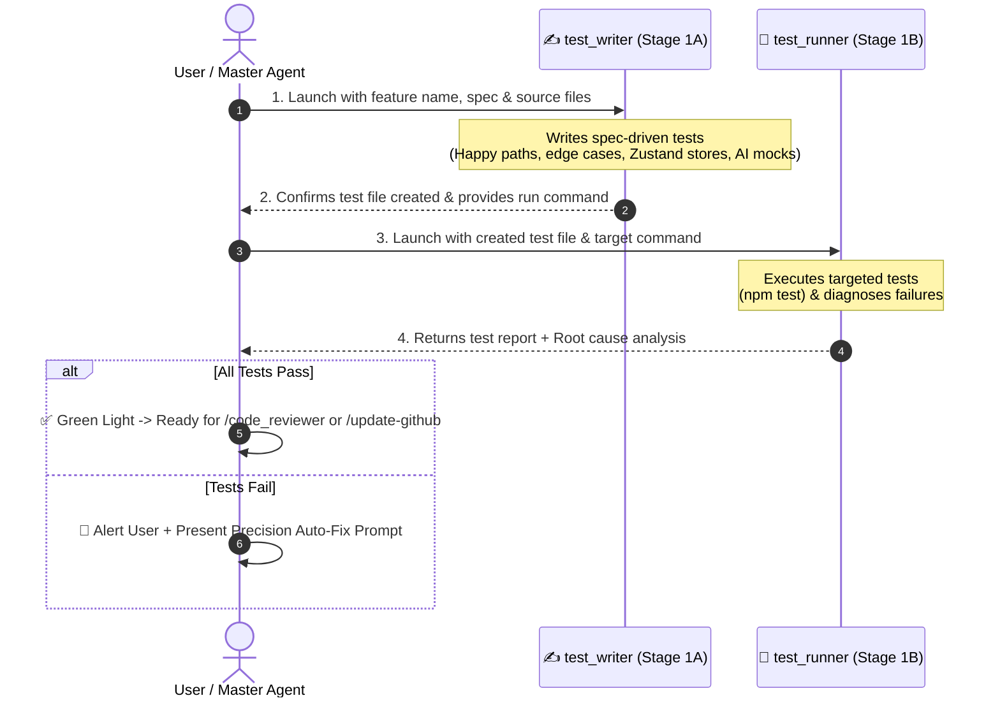

# 🧪 Test Runner — Two-Stage Test Authoring & Execution Pipeline

`test_runner` is an automated testing workflow designed to guarantee behavioral correctness and prevent regressions across the **Future You** application. It enforces a strict **two-stage sequential pipeline** where test authoring ([`test_writer`](file:///d:/Future%20You/.agents/skills/test_writer/SKILL.md)) is decoupled from test execution, diagnosis, and root-cause analysis (`test_runner`).

---

## 🎯 Architecture: Two-Stage Sequential Pipeline



---

## 🔒 Strict Handoff & Safety Rules

1. **Strict Sequential Execution**: `test_runner` must NEVER start until `test_writer` has fully completed writing the test file and verified its syntax and imports.
2. **Targeted Execution**: Run ONLY the test file authored for the target feature (e.g. `npm test -- src/components/onboarding/step-goals.test.tsx`). Do not run unrelated full test suites during rapid iteration.
3. **Zero In-Flight Code Mutation**: Neither subagent is permitted to alter application source code during the testing pipeline. They report findings and provide an actionable fix prompt.
4. **Spec-Driven Over Implementation-Driven**: `test_writer` writes tests based on what the specifications in [`GEMINI.md`](file:///d:/Future%20You/GEMINI.md), [`implementation_plan.md`](file:///d:/Future%20You/implementation_plan.md), and `docs/specs/` require, not merely copying existing implementation quirks.
5. **Privacy & Storage Invariants**: Tests must assert that user data is saved under `future-you:` keys in localStorage and never leaked over network calls.
6. **Coverage Threshold Invariant**:
   - Line coverage: $\ge 80\%$
   - Branch coverage: $\ge 70\%$
7. **Timeout & Execution Guardrails**:
   - Stage 1A (`test_writer` authoring): Max 120s wall-clock time limit.
   - Stage 1B (`test_runner` execution): Max 60s per test file execution limit.

---

## 🛠️ Test Commands & Execution

All test commands align with `package.json` scripts:

| Domain | Target Directory | Targeted Execution Command | Full Suite & Coverage |
| :--- | :--- | :--- | :--- |
| **UI Components** | `src/components/**/__tests__/` | `npm test -- src/components/ui/button.test.tsx` | `npm run test:coverage` |
| **Zustand Stores** | `src/stores/__tests__/` | `npm test -- src/stores/onboarding-store.test.ts` | `npm run test:coverage` |
| **AI Client & Prompts** | `src/lib/ai/__tests__/` | `npm test -- src/lib/ai/generate-personas.test.ts` | `npm run test:coverage` |
| **TTS & Utilities** | `src/lib/__tests__/` | `npm test -- src/lib/tts.test.ts` | `npm run test:coverage` |

---

## 🏷️ Expanded Failure Classification Taxonomy

When test assertions fail, classify the failure using this project-specific taxonomy:

| Failure Type | Root Cause Indicator | Typical Solution |
| :--- | :--- | :--- |
| `ZUSTAND_STORE_MOCK` | State leaks across tests or actions undefined | Call `useStore.getState().reset()` or clear mocked state in `beforeEach()`. |
| `LOCALSTORAGE_PREFIX` | Data saved without `future-you:` prefix | Ensure Zustand persist key and manual storage helpers prepend `future-you:`. |
| `OPENAI_CLIENT_MOCK` | `client.chat.completions.create` returning undefined | Configure mock to return valid OpenAI structure `{ choices: [{ message: { content: '...' } }] }`. |
| `PARSE_JSON_FAIL` | `JSON.parse` error on AI response | Ensure fallback JSON parser strips markdown backticks (`\`\`\`json`) or provides safe default model. |
| `TTS_SPEECH_MOCK` | `window.speechSynthesis` is undefined in JSDOM | Mock `window.speechSynthesis` and `window.SpeechSynthesisUtterance` in test setup. |
| `HYDRATION_ERROR` | `Text content does not match server-rendered HTML` | Ensure browser-dependent data (e.g. localStorage state) is mounted inside `useEffect` or client boundary. |
| `REACT_ACT_WARNING` | `Warning: An update to Component was not wrapped in act(...)` | Wrap state transitions in `await waitFor(...)` or `act(async () => { ... })`. |
| `TYPE_ERROR` | TypeScript compilation or type mismatch | Run `npx tsc --noEmit` and resolve interface discrepancies. |
| `ASSERTION_FAIL` | Expected value does not equal actual returned value | Business logic bug in store or incorrect test expectation. |
| `TIMEOUT` | Async operation exceeded test timeout limit | Ensure mocked promises resolve and abort signals are handled. |

---

## 📋 Execution Procedure

### Step 1 — Authoring Tests ([`test_writer`](file:///d:/Future%20You/.agents/skills/test_writer/SKILL.md))

Invoke `test_writer` with:
- **Feature / Target**: e.g., `src/stores/onboarding-store.ts`
- **Spec References**: `docs/specs/<feature-slug>.md`
- **Requirements to Cover**:
  - Happy paths & standard state transitions
  - Boundary limits (slider mins/maxs)
  - `future-you:` prefix enforcement
  - Error recovery & timeout fallbacks

_Wait for `test_writer` to finish before proceeding._

---

### Step 2 — Running & Diagnosing Tests (`test_runner`)

Invoke `test_runner` with:
- **Test File Path**: Path generated by `test_writer`.
- **Execution Command**: `npm test -- <path-to-test>`
- **Context Source Files**: Implementation files to inspect if failures occur.

---

## 📤 Standard Report Output Format

````markdown
# 🧪 Testing Pipeline Report — [Feature Name]

### ✍️ Step 1 — Tests Authored (test_writer)

- **Target File**: `[src/components/.../button.test.tsx](file:///d:/Future%20You/src/components/.../button.test.tsx)`
- **Key Test Cases Covered**:
  - `test_renders_correctly`: Validates component renders with appropriate classes and aria-labels.
  - `test_keyboard_nav`: Asserts button is reachable and activatable via Enter/Space.
  - `test_loading_state`: Asserts spinner renders and button is disabled when loading.

---

### 🏃 Step 2 — Execution Results (test_runner)

- **Command Executed**: `npm test -- src/components/.../button.test.tsx`
- **Results**: `5 passed, 0 failed`
- **Coverage**: `Line: 90%, Branch: 80%`

---

### 🚨 Failure Analysis & Root Cause (Only if tests fail)

#### Failure: `test_loading_state`

- **Classification**: `ASSERTION_FAIL`
- **Location in Code**: `[src/components/ui/button.tsx:42](file:///d:/Future%20You/src/components/ui/button.tsx#L42)`
- **Expected**: Button has `disabled` attribute when `isLoading` is true.
- **Actual**: Button remained enabled.
- **Root Cause**: Missing `disabled={disabled || isLoading}` prop binding.

---

### 🚦 Verdict

- [ ] ✅ **Ready for Code Review**: All tests passed without issues.
- [ ] ❌ **Needs Fixes**: See the curated fix prompt below.

---

### ⚡ Curated Auto-Fix Prompt (If tests failed)

> ```text
> Fix the failing tests in [Feature Name]:
> 1. In [src/components/ui/button.tsx:L42], add `disabled={disabled || isLoading}` to the button element.
> 2. Re-run `npm test -- src/components/ui/button.test.tsx` to confirm all assertions pass.
> ```
````

---

## 🚀 Triggers

- `/test_runner [feature-name]`
- `/test-feature [feature-name]`
- `"Run tests for onboarding store"`
- `"Write and run tests for persona generator"`
