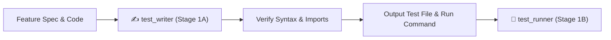

# ✍️ Test Writer — Spec-Driven Test Authoring Engine

`test_writer` is the dedicated test authoring subagent and skill for **Future You**. It synthesizes robust, spec-driven unit and integration tests based on technical specifications in [`GEMINI.md`](file:///d:/Future%20You/GEMINI.md), [`implementation_plan.md`](file:///d:/Future%20You/implementation_plan.md), and `docs/specs/`.

---

## 🎯 Architecture: Role & Decoupled Execution

`test_writer` operates strictly in **Stage 1A** of the verification pipeline:

1. It receives the target feature name, specification path, and implemented source code.
2. It writes comprehensive, non-tautological tests covering happy paths, edge cases, Zustand stores, local storage isolation, and mock AI responses.
3. It validates syntax and imports before handing off to **`test_runner`** (Stage 1B) for execution.



---

## 🔒 Non-Negotiable Invariants & Principles

1. **Spec-Driven Over Implementation-Driven**:
   - Write tests based on what the specification requires, NOT by copying implementation bugs or quirks.
   - Never write trivial/tautological tests that assert `true === true`.
2. **Local-First Privacy & Storage Invariant**:
   - Tests must verify that all stored keys utilize the `future-you:` prefix.
   - Tests must verify that the clear/delete data routine fully purges all records.
3. **Honesty Disclaimer Verification**:
   - Prompt generator tests must assert that the system prompt includes: *"You are a reflection tool, not a prediction engine"*.
4. **Coverage Threshold Requirements**:
   - Line coverage: $\ge 80\%$
   - Branch coverage: $\ge 70\%$
5. **Hermetic & Isolated**:
   - Tests must NOT make live network calls to OpenAI or external endpoints.
   - Use in-memory mocks from the **Codebase Mock Catalog**.

---

## 🧰 Codebase Mock Catalog & Testing Patterns

### 1. Zustand Store Mock Pattern

When testing components that interact with Zustand or testing stores directly:

```typescript
import { act } from '@testing-library/react';
import { useOnboardingStore } from '@/stores/onboarding-store';

const initialStoreState = useOnboardingStore.getState();

describe('Onboarding Store', () => {
  beforeEach(() => {
    act(() => {
      useOnboardingStore.setState(initialStoreState, true);
      localStorage.clear();
    });
  });

  it('updates goals and persists under future-you: prefix', () => {
    act(() => {
      useOnboardingStore.getState().setShortTermGoals(['Run a 5k', 'Read 12 books']);
    });

    expect(useOnboardingStore.getState().goals.shortTerm).toContain('Run a 5k');
    const stored = localStorage.getItem('future-you:onboarding');
    expect(stored).toBeDefined();
  });
});
```

---

### 2. LocalStorage Mock Pattern

```typescript
export function setupLocalStorageMock() {
  let store: Record<string, string> = {};

  const localStorageMock = {
    getItem: jest.fn((key: string) => store[key] || null),
    setItem: jest.fn((key: string, value: string) => {
      store[key] = value.toString();
    }),
    removeItem: jest.fn((key: string) => {
      delete store[key];
    }),
    clear: jest.fn(() => {
      store = {};
    }),
  };

  Object.defineProperty(window, 'localStorage', {
    value: localStorageMock,
    writable: true,
  });

  return localStorageMock;
}
```

---

### 3. OpenAI Client & LLM Response Mock Pattern

When testing AI orchestrators (`generate-personas.ts`, `generate-life-model.ts`):

```typescript
import { generatePersonas } from '@/lib/ai/generate-personas';
import OpenAI from 'openai';

jest.mock('openai');

describe('generatePersonas', () => {
  const mockCreate = jest.fn();

  beforeEach(() => {
    jest.clearAllMocks();
    (OpenAI as unknown as jest.Mock).mockImplementation(() => ({
      chat: {
        completions: {
          create: mockCreate,
        },
      },
    }));
  });

  it('correctly parses structured JSON and includes honesty disclaimer', async () => {
    mockCreate.mockResolvedValue({
      choices: [
        {
          message: {
            content: JSON.stringify({
              currentPath: { summary: 'Working at desk', emotionalState: 'Reflective' },
              improvedPath: { summary: 'Running business', emotionalState: 'Energized' },
            }),
          },
        },
      ],
    });

    const result = await generatePersonas({/* mock onboarding inputs */});
    expect(result.currentPath.summary).toBe('Working at desk');
    expect(mockCreate).toHaveBeenCalledWith(
      expect.objectContaining({
        messages: expect.arrayContaining([
          expect.objectContaining({
            content: expect.stringContaining('You are a reflection tool, not a prediction engine'),
          }),
        ]),
      })
    );
  });
});
```

---

### 4. Web Speech API (TTS) Mock Pattern

When testing the TTS playback component:

```typescript
export function setupSpeechSynthesisMock() {
  const mockSpeak = jest.fn();
  const mockCancel = jest.fn();
  const mockPause = jest.fn();
  const mockResume = jest.fn();

  Object.defineProperty(window, 'speechSynthesis', {
    value: {
      speak: mockSpeak,
      cancel: mockCancel,
      pause: mockPause,
      resume: mockResume,
      speaking: false,
      paused: false,
      getVoices: jest.fn(() => []),
    },
    writable: true,
  });

  (window as any).SpeechSynthesisUtterance = jest.fn().mockImplementation((text) => ({
    text,
    rate: 1,
    pitch: 1,
    onend: null,
    onerror: null,
  }));

  return { mockSpeak, mockCancel, mockPause, mockResume };
}
```

---

### 5. React Component & Accessibility Test Pattern

```typescript
import { render, screen, fireEvent } from '@testing-library/react';
import { Button } from '@/components/ui/button';

describe('Button Primitive', () => {
  it('renders with accessible aria-label and triggers onClick', () => {
    const handleClick = jest.fn();
    render(<Button aria-label="Submit onboarding" onClick={handleClick}>Submit</Button>);

    const button = screen.getByRole('button', { name: /submit onboarding/i });
    expect(button).toBeInTheDocument();

    fireEvent.click(button);
    expect(handleClick).toHaveBeenCalledTimes(1);
  });
});
```

---

## 📋 Input & Output Contract

### Input Contract:
- `feature_name`: e.g. `step-1-1-button-card`
- `spec_path`: `docs/specs/<feature-slug>.md`
- `source_files`: Array of implemented source files

### Output Contract:
- `test_file_path`: Path to generated test file (e.g. `src/components/ui/__tests__/button.test.tsx`)
- `run_command`: Exact command line to execute the test file (e.g. `npm test -- src/components/ui/__tests__/button.test.tsx`)
- `test_count`: Total number of test assertions written

---

## 🚀 Triggers

- Automatic invocation from `/verify_step` (Stage 1A)
- Automatic invocation from `/test_runner` (Step 1)
- Manual command: `/test_writer [feature-name]`
