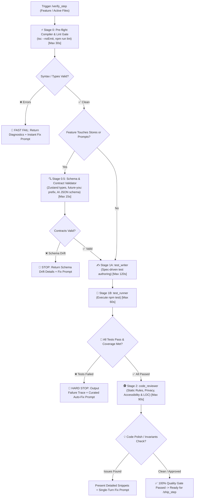

# 🧪 Verify Step — Dynamic & Static Quality Gate Pipeline

`verify_step` is the automated quality gate for **Future You**. It guarantees that newly written code **actually works dynamically** (automated unit/integration tests pass with $\ge 80\%$ coverage), **conforms to store and AI contracts** (Zustand state interfaces & JSON schemas), AND **is architecturally sound statically** (reviewed for TypeScript rules, aria-labels, 300 LOC limit, privacy, and honesty disclaimer) before any code is committed or merged into `main`.

---

## 🔄 End-to-End Pipeline Workflow



---

## 🛑 MANDATORY STOP GATE: Anti-Auto-Advance Rule

> **CRITICAL RULE**: After `/verify_step` completes compiler checks, contract validation, dynamic tests, and static code review, the agent **MUST IMMEDIATELY STOP** and present the Quality Gate Report.
> **DO NOT** commit changes to git.
> **DO NOT** push to GitHub.
> **DO NOT** open a PR or merge into main.
> **DO NOT** trigger `/ship_step` automatically.
> Wait for the developer to review and explicitly trigger `/ship_step`. The only exception is `/auto_cycle`.

---

## ⏱️ Timeout & Budget Guardrails

To prevent hangs or infinite loops during verification:

| Stage | Operation | Max Wall-Clock Time | Failure Action |
| :--- | :--- | :--- | :--- |
| **Stage 0** | Compiler & Lint Check | **30s** | Kill process, output type/lint errors |
| **Stage 0.5** | Store & Schema Contract Validation | **15s** | Halt on schema drift or missing prefix |
| **Stage 1A** | `test_writer` Authoring | **120s** | Check syntax, verify test file exists |
| **Stage 1B** | `test_runner` Execution | **60s** per test file | Terminate hung test, diagnose async lock |
| **Stage 2** | `code_reviewer` Review | **90s** | Generate actionable fix prompt |

---

## 🔒 Automated Execution Stages

### Stage 0: Pre-flight Compiler & Lint Gate

Before invoking testing subagents, execute a fast static compilation sweep:

1. **TypeScript Compilation**:
   ```bash
   npx tsc --noEmit
   ```
2. **Next.js & ESLint**:
   ```bash
   npm run lint
   ```
3. **Fast-Fail Gate**:
   - If syntax, import, lint, or type errors are discovered, **HALT IMMEDIATELY**.
   - Output the exact compiler errors and provide an instant fix prompt without wasting token cycles on dynamic tests.

---

### Stage 0.5: Schema & Contract Validator

_(Triggered conditionally when the feature touches stores, prompts, or data models)_

1. **Target Files**: `src/stores/*.ts`, `src/types/*.ts`, `src/lib/ai/*.ts`, `src/lib/prompts/*.ts`.
2. **Contract Invariants Verified**:
   - **LocalStorage Prefix**: All Zustand persist keys use `future-you:[key]`.
   - **Honesty Disclaimer**: All system prompt templates in `src/lib/prompts/` explicitly include: *"You are a reflection tool, not a prediction engine"*.
   - **Component Conventions**: React components exported as `function` declarations (not arrow functions), props destructured and typed via `interface`.
   - **File Length $\le 300$ Lines**: Verified using line counts.
3. If contract drift is detected, **HALT IMMEDIATELY** and report the discrepancy before authoring tests.

---

### Stage 1: Dynamic Behavioral Verification (`test_writer` ➔ `test_runner`)

#### Stage 1A — Test Authoring ([`test_writer`](file:///d:/Future%20You/.agents/skills/test_writer/SKILL.md)):
1. Reads target feature specification (`docs/specs/...`) and [`GEMINI.md`](file:///d:/Future%20You/GEMINI.md) contracts.
2. Employs standardized module fixtures from the **Codebase Mock Catalog** (Zustand mock, localStorage mock, SpeechSynthesis mock, OpenAI client mock).
3. Writes tests targeting:
   - Line coverage: $\ge 80\%$
   - Branch coverage: $\ge 70\%$
4. Saves tests to `src/components/**/__tests__/`, `src/stores/__tests__/`, or `src/lib/**/__tests__/`.

#### Stage 1B — Test Execution (`test_runner`):
1. Runs strictly **AFTER** `test_writer` completes and validates test syntax.
2. Executes targeted test command: `npm test -- <path-to-test>`.
3. Parses assertion results and coverage.
4. **Hard Failure Gate**:
   - If any test fails or coverage is unmet, **HALT IMMEDIATELY**.
   - Do NOT run `code_reviewer` on broken code.
   - Output exact file & line number, expected vs actual behavior, failure classification, and an executable auto-fix prompt.

---

### Stage 2: Static Architecture, Privacy & Performance Review ([`code_reviewer`](file:///d:/Future%20You/.agents/skills/code_reviewer/SKILL.md))

_(Triggered only after all tests pass 100%)_

1. Inspects `git diff` against **Future You Invariants**:
   - **Function Declarations**: Component defined as `function MyComponent(props: Props) {}`.
   - **File Length Gate**: $\le 300$ LOC per file.
   - **Aria Labels & WCAG AA**: All interactive controls have accessible labels.
   - **Privacy Rule**: ZERO server storage, all local under `future-you:`.
   - **JSDoc Comments**: Every exported symbol documented.
2. Formats all suggestions with concrete line numbers, drop-in replacement snippets, and a single-turn copy-pasteable fix prompt.

---

## 📤 Standard Output Format

````markdown
# 🛡️ /verify_step Quality Gate Report — [Feature Name]

### ⚡ Stage 0 — Pre-flight Compilation & Lint

- **Commands**: `npx tsc --noEmit`, `npm run lint`
- **Status**: `✅ 0 type errors, 0 lint errors`

---

### 🔍 Stage 0.5 — Schema & Contract Validation

- **Status**: `✅ Storage keys prefixed with future-you:, disclaimer present in prompts, <= 300 LOC verified`

---

### 🧪 Stage 1 — Dynamic Test Execution

- **Stage 1A (Authoring)**: `test_writer` generated `[src/.../button.test.tsx](file:///d:/Future%20You/src/.../button.test.tsx)`
- **Stage 1B (Execution)**: `npm test -- src/.../button.test.tsx`
- **Status**: `✅ 5 passed, 0 failed`
- **Coverage**: `Line: 88%, Branch: 76%`

---

### 🚨 Test Failure Diagnosis _(Only if tests fail)_

- **Failed Assertion**: `test_loading_state`
- **Classification**: `ASSERTION_FAIL`
- **Location**: `[src/components/ui/button.tsx:42](file:///d:/Future%20You/src/components/ui/button.tsx#L42)`
- **Expected**: Button disabled when loading.
- **Root Cause**: Missing `disabled` prop binding.
- **⚡ Curated Auto-Fix Prompt**:

> ```text
> Update button.tsx to bind disabled={disabled || isLoading}.
> ```

---

### 🕵️ Stage 2 — Static Code Quality & Privacy Review

_(Only displayed if tests pass)_

#### 🛡️ Architecture & Invariants Audit
- [x] Function declarations used for components: `PASSED`
- [x] File length <= 300 lines: `PASSED`
- [x] Aria labels & contrast verified: `PASSED`
- [x] JSDoc comments on exports: `PASSED`
- [x] Local-first privacy intact: `PASSED`

#### 💡 Worth Improving

- **[Finding Title]**: `[src/components/ui/button.tsx:42](file:///d:/Future%20You/src/components/ui/button.tsx#L42)`
- **Observation**: Missing focus ring on active keyboard navigation.
- **Recommended Fix**:

```typescript
// Proposed snippet
```

---

### 🚦 Final Quality Gate Verdict

- [ ] ❌ **BLOCKED**: Compilation, contracts, or tests failed. Run the curated fix prompt above.
- [ ] 🟡 **PASSED WITH POLISH**: Tests pass, but review suggestions are recommended.
- [ ] 🟢 **100% READY TO SHIP**: All tests passed, contracts verified, accessibility checked, and code is clean. Ready for `/ship_step`.
````

---

## 🚀 Triggers

- `/verify_step`
- `/verify_step [feature-name]`
- `"Verify implementation and run tests"`
- `"Run full quality gate on recent changes"`
